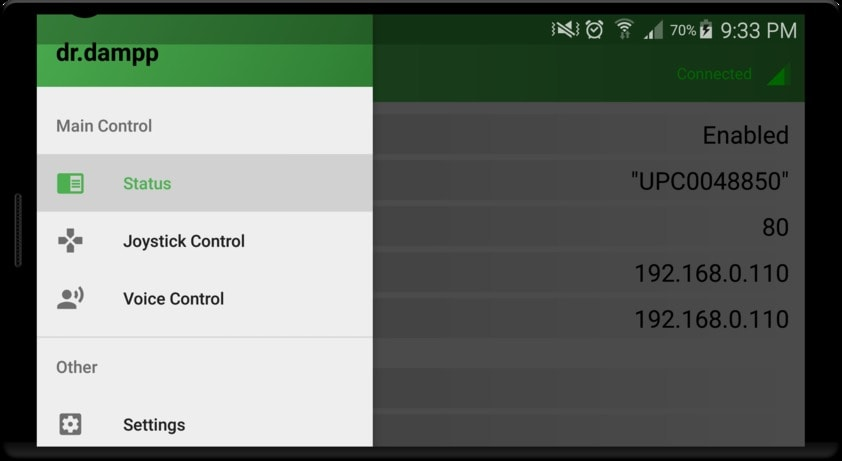

# Dr.Dampp

Four wheel drive multi-functional transport platform, controlled by Android phone.
Two-way communication based on UDP protocol - Raspberry works as a server, phone as a client.

## Android application

<div align="middle" >


</div>

Android application allows us to control vehicle remotly using Wi-Fi connection. All the necessary information about connection is displayed in Status menu option. There are 2 control options implemented - "Joystick Control" and "Voice Control". Joystick control feature is delivered as a (double or single rod) 2-channel graphic gamepad. Voice control feature supports voice commands "go ahead", "go back", "left", "right" and "stop". Offline voice recognition is provided by [PocketSphinx](https://www.cmusphinx.github.io/) library. 

## Raspberry software
Simple UDP server implemented in C language, responsible for receiving data from android application in order to control electric motors speed (with help of L298N motor conroller) through GPIO pins. Communication with GPIO pins is served by [WiringPi](http://wiringpi.com/) 

## Hardware
Raspberry Pi 3 with [Raspbian OS](https://www.raspberrypi.org/downloads/raspbian/) and server application installed, works as a main vehicle controller. Four electric motors are controlled by two L298N modules. Power is provided by 3C 11,1V Li-Po accumulator.

## Extra information
To clone whole project at once use recursive mode:
```
git clone --recursive git://github.com/thirteendollars/Dr.Dampp.git
